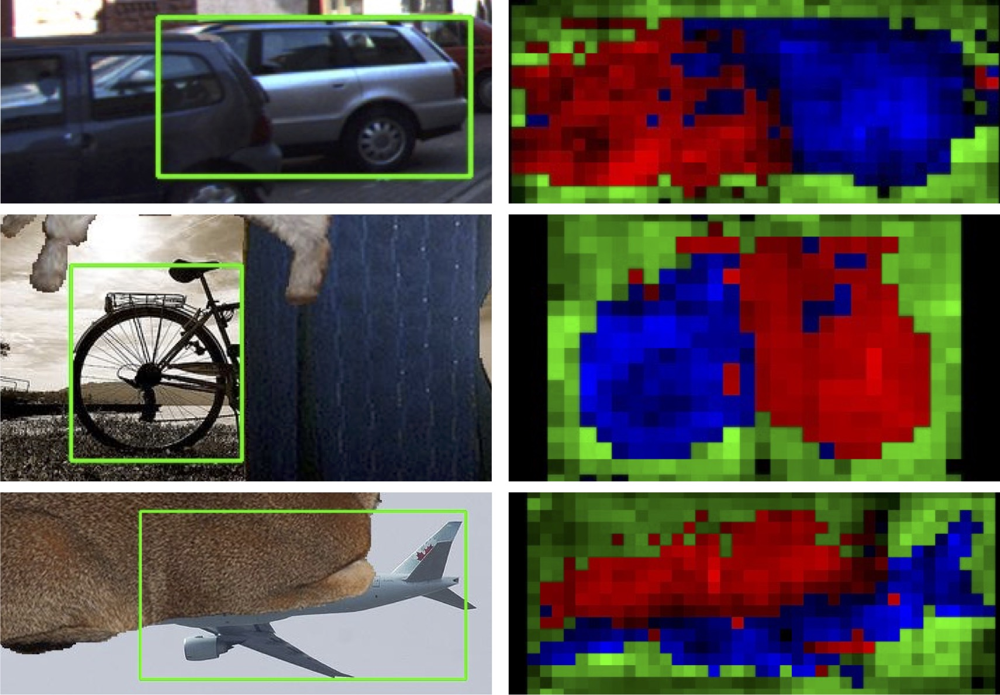
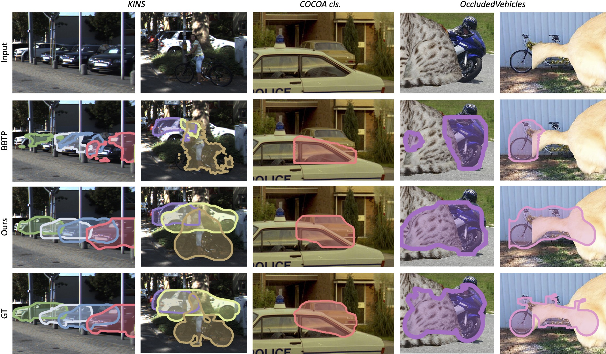
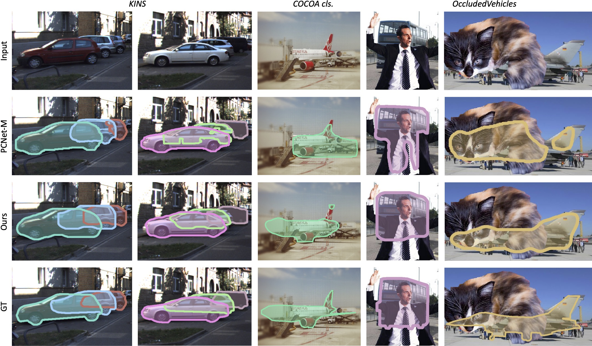

# Amodal Segmentation through Out-of-Task and Out-of-Distribution Generalization with a Bayesian Model
[Yihong Sun](https://yihongsun.github.io), [Adam Kortylewski](http://adamkortylewski.com), [Alan Yuille](https://www.cs.jhu.edu/~ayuille/). _CVPR 2022_

[[PDF](https://arxiv.org/abs/2010.13175)] &nbsp; 

Official PyTorch code for the paper: *Amodal Segmentation through Out-of-Task and Out-of-Distribution Generalization with a Bayesian Model* 




## Quick Start

### Setup environment / Download models and dataset

```
conda env create -f environment.yml
conda activate amodal
bash download.sh
```

* In the case that `download.sh` cannot be executed properly, please identify the missing directory and rerun the `wget` command for the corresponding zip file. If the issue persists, please refer to the `download.sh` description below.

### Run experiments

* Table 1: change the file `Code/configs.py` to set `TABLE_NUM = 1` and `MODEL_TYPE = 'ML'` or `MODEL_TYPE = 'E2E'` and run the command below. 

* Table 2: change the file `Code/configs.py` to set `TABLE_NUM = 2` and `MODEL_TYPE = 'ML'` or `MODEL_TYPE = 'E2E'` and run the command below. 

* Table 3: change the file `Code/configs.py` to set `TABLE_NUM = 3` and `MODEL_TYPE = 'ML'` or `MODEL_TYPE = 'E2E'` and run the command below. 

```
cd Code
python3 run_experiment.py
```

### Optional: `download.sh` Description

#### Download models

* Download pretrained model weights from [here](https://drive.google.com/file/d/1Py2nadGXyeNBwPDzrrrPaRsYyy-UVZE9/view?usp=sharing), unzip `Models.zip` and place the folder as `/Models/`.

* Download RPN results used for evaluatiooon from [here](https://drive.google.com/file/d/1SQlYawHkBggs6smS3FGH4nLrfGrp5A-d/view?usp=sharing), unzip `RPN_results.zip` and place the folder as `/RPN_results/`.

#### Download dataset

* Download Occluded Vehicle Dataset from [here](https://drive.google.com/file/d/1hx6eErHtuR7TCGlQMyl2_03gXDTQw3Qm/view?usp=sharing), unzip `Occluded_Vehicles.zip` and place the folder as `/Dataset/Occluded_Vehicles/`.

* Download KINS Dataset from [here](https://drive.google.com/file/d/1DeaVbE_CwdIjogIPS3jCRKMOSqTGVloA/view?usp=sharing), unzip `kitti.zip` and place the folder as `/Dataset/kitti/`.

* Download COCOA Dataset from [here](https://drive.google.com/file/d/1n1vvOaT701dAttxxGeMKQa7k9OD_Ds51/view?usp=sharing), unzip `COCO.zip` and place the folder as `/Dataset/COCO/`. Additionally, download COCO data [train2014](http://images.cocodataset.org/zips/train2014.zip) and [val2014](http://images.cocodataset.org/zips/val2014.zip) and place the folders as `/Dataset/COCO/train2014/` and `/Dataset/COCO/val2014/`.


## Qualitative Results

<p float="left">
  
   
</p>


## Citation

Please cite the following papers if you use the code directly or indirectly in your research projects.
```
@article{sun2021amodal,
  title=Amodal Segmentation through Out-of-Task and Out-of-Distribution Generalization with a Bayesian Model},
  author={Sun, Yihong and Kortylewski, Adam and Yuille, Alan},
  journal={arXiv preprint arXiv:2010.13175},
  year={2021}
}
```


